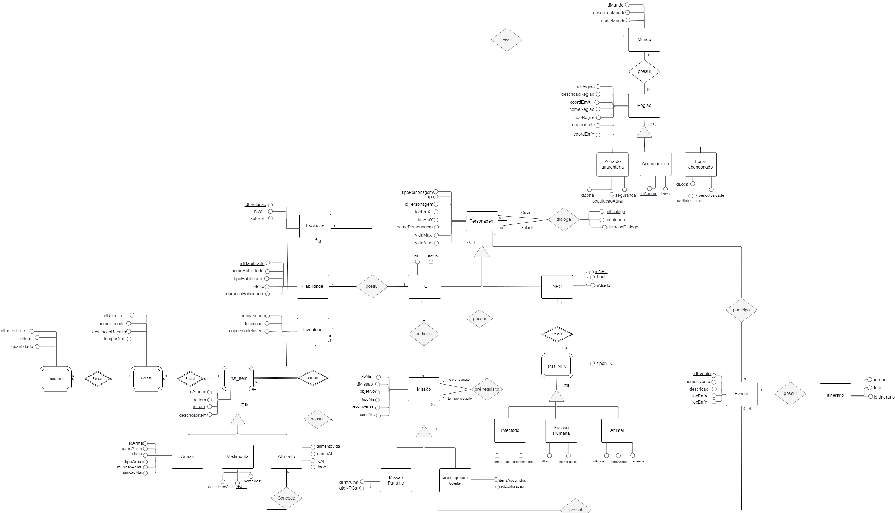
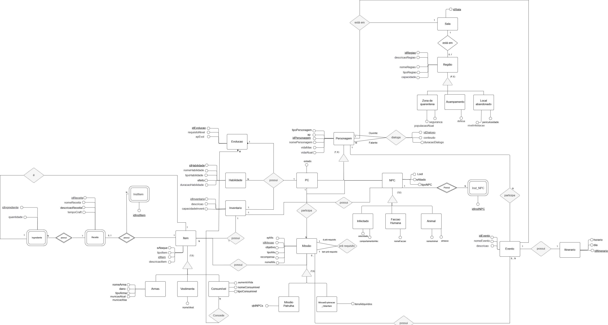

# DER - Diagrama Entidade Relacionamento

O Diagrama Entidade Relacionamento (DER) é composto por um conjunto de objetos gráficos que visa representar todos os objetos do modelo Entidade-Relacionamento tais como entidades, atributos, atributos chaves, relacionamentos, restrições estruturais, etc.

O diagrama fornece uma visão lógica do banco de dados, fornecendo um conceito mais generalizado de como estão estruturados os dados de um sistema.

### Versão atualizada

<iframe width="790" height="535" src="https://app.diagrams.net/#R%3Cmxfile%3E%3Cdiagram%20name%3D%22P%C3%A1gina-1%22%20id%3D%22Ypu0qzVmkGxdyRMtPEGp%22%3E7V1Jc9rK2v4t38JV9yykUg9SS0vjIXESO44TEtublBhsKwGEGWwni%2Fz2rwUIpO7WSLeYlFt1TwKoEXrn6XmP0En%2F7d3IHT5d%2Bp1u7wganbcjdHoEIQamSf8TvPJn%2FgpwDDJ%2F5XHkdRavrV746v3tLl40Fq9OvU53HPvgxPd7E28Yf7HtDwbd9iT2mjsa%2Ba%2Fxjz34vfi3Dt3HLvfC17bb41%2F94XUmT%2FNXbUhWr7%2Fveo9P4TcDy5m%2F03fDDy9%2ByfjJ7fivkZfQ2RE6Gfn%2BZP63%2FttJtxc8vfC5zK87T3h3eWOj7mCS54IXf%2Fowem69fm0eO9rn2yE234ba4pQXtzdd%2FODr7mjsD%2BjP6h8t73zyJ3wcT5N%2Bj%2F4NHKGG%2F9IdPfRmv6jV89u%2F6Uuz%2F34dum1v8Lj41OuTN%2BkGLwUHvFImoa89%2BIPJgtLA0gl9Zby8xqH%2FGvnTQafbWZzgtsZ%2BbzrpHo%2Fa4UXBq8t%2FBVeMJyP%2F95JAV%2B4Vfa03bXudi%2BCUi9NG02n86Q2%2F6Ii%2BwT%2B48Cl0R5PuW%2BSlxYN81%2FX73cnoD%2F3I4l0NIzy%2FZsHXGgw5%2FXXFJSB8gE8RDiGLz7kLxnxcHr6iHf3LgnwFSAk5Uqqh3mTkuYPH4MhGxxtRmfP8AX137E%2BD391wB%2B0nf3Tte4PJaeRtg6E7ilEd6faSiid%2Bzx%2FN7hdZsz%2BlOGLkT9zFV2uAOLoT%2FROw3IPX60W%2B6sEM%2FpfJSo%2FvG83Ox8b3pn%2F8tPhFkUPmf2SxmGHGWQyESifCYpaAw7AEDvvygIfao3n1%2Brl987f5%2Bu6UND5oEBOOxyYzPTEcHZ2gI8qMo%2B7z1Bt7E5%2FjPfqz6f01Iizo9rzHgD5t%2BpC69Ak2gofjUdV7vHij73U6Mz4bdcfeX7c1OypgpGHAXbNfZzaOzNPgrOnEH694Ic5JA3%2FQZSi%2BeEkGnUzKy1E6YWzwmgAI6ISM9el0fXtyYVw3v36%2F%2FW7dfLu4eD65%2BKUBgDk6dY8n7jP9h0yyiLTDSlJDiT93%2B14veDbvu72XbnCS0ARERanTfXCnvUn4ucXdGpIIBrAN4xQDROe1t2WqIZlQefMEu7o%2B2Q%2FrO6Aq07qZtI%2Fv%2Bi%2FSKEhvnNWOSMfQiPyB%2BeyxTXQHKqKqWcgk%2F%2BpOJn%2FCh2znoB4S2UzzLPgfRxWgmzxtVzSlT7vR7VDPd3Fn%2Fmjy5D9SP7B3tnqVHumOJseBV71Sod1Bh33lzZvcLr4i%2BPtdILuzr6ckH%2F25jf8zeFczdAMuX6EeqEeff6B7ZjK%2FYiVCWeni8nb06fyqtzj89G3xqdk%2F%2FmSpCeqljNrdFJItdDn9oY%2FdSba3FTyzVJaNsp8hYL%2Fli6NujzosL%2FGwQ4FpMDie%2FN%2B3I3hy9t8BWWw77rybAt%2FdVGSw05guGoXtifLvU4l9wcg9N54%2FSaKeZTKhFxBFXpgnn6PO3yoWe%2B28ovfpD52%2Fcu4Fj2qugAedJWfFeMBzGs2xc3ZGtONRxDwYOrRRzEQ4dqpSD%2F7B2oZEhtqAYp59B31E7p%2FIBxaKb3ULs8g46ssgaMW9UdOOcqToCrL2FchguH5%2B3yn3qBtxscMQ6UY0qI4%2FmLmhXRyUem%2FYEN%2Fb8qi5LeaOmonqkqDlla8gWDp44Q1lNHDMDIf34wSSuPTtQNSzizh6yW6ddtVofjlG5nDi9tdy3sIEcZbzFlqM7VMS0pmbD0EG9NBokrcaN4PJlEEbtmeZstCl7HUfJoKUIOtgTvxhmrP4Obh8EhqM4s4MmxSc%2FeGkNM69D59pUPL44%2Frj89ePklwcErLVMrts2LyPYyKeIaGq7DKwai25WS3pXjead62TZ3N89qUaLWkfjJa0OeZ%2B8TrupftWq8d11eMHyrb4vT2afPwNZUWAiFGPgPCVEbtK7Qj5CJ7%2BREoab%2BiqYaHRk99vTccZIb38ulq5shm8azT7YzgY6rjNc7vUshmbHgBWzsKsjPSAmDn4AONi8NBtT9wOXybbySzPyGg0335C%2FfzXJ1k5OgSBDuMpfgiJbsNIxIk2TVjeub70xuNZKRRtgLRzaZdN3FdK3Lb38qX779RSJKOIbFxGeff23G23XUpFa1aIbI3o3x6Dv72f9t2BIq1eteD%2BobTVj1vPP19fO5JoC6iUbr3g8n0Mauh50L0y7ylz%2BX9vf15OTi8VG30ATLYgDADDdHwErap5RsxzTiGe2%2FkAmikGGzq2w%2FT%2B3ewWjPn3pAXJNC42YDxQdsgyck4OlT3QaDqDz%2BT1%2BBancVh2lXehKLYvBE7IptsWq3wJDCUjZ7LfJjpwIn0U3HG2YRoolCor%2FgsS0v6yAnXEV68PS4jMiAituiYyZCgqQcFFAGaL0ICKkDf4%2BPrOOj9OE6HdkQyblQxgA0Y0%2BKugleOyTImydStZooBFRcrCaxfSglu17NUx8aoahKZuWZGbsONfo7jIhmDtcan3uCwqtA%2FtK3f0%2FUF1d7IFs3toVPlXNxP7ZnDz88P1e%2Bfu18OHl%2B7g7y%2FNAhxDZavfeLfq6jOf%2FCCRytmQoGfpKNYRJdbMy9YF2c1pKKfSLaZLeV3imGyGlY3FEvRFYbVMnIRvEupWaepIkK%2F1x%2BOpp0Yp7Vay9gY2mn9vv%2F8bfX8FirWIzfHZphNB6MC6QVI9zLxBGhui5fAv7yiTNYzz%2B7sv069r6cTQO8uM5UIXZPs8VunOFp%2BXfu%2B2vJ7XcTv8BMhOJi4BZZ%2FXH8M7cuX%2FkZVDMriRgo0rIz4rfTzw%2Bm5vP4ioUSLajbdG6xFIMihMY%2FfWJZ5RscTzfluX1PzFikt6qNHU7%2FXev5N%2F7f3IRDgxJs2RhgCMm1TikiD%2B38KsRcptVpaaOLDEfK7OtvJtaudUXOG18Utv%2FXrcC3Hl%2FAIEUlk6GAex1rsgrDvkbc%2Fn7pCxX%2Fmb8YFN2DvRY0OVYUWkIuHEPEDFxBv61buz%2B9ugFwhsR%2Fv15x0kl7JcaQQYhg4npGKel8ULddhIJ3%2FAulgC%2BrC1vIPz6XnrqvPy%2BfKKpLFNZlyO8yY1NxaXy9O40tQin7%2FsPnRFsBsVNZ3NGTyuvqpTaGxgGfBmo9kH8Gd7KkulQdYHF4CxgCoV2oElKitwW1%2BQezO9vz5dT53tnH%2FLuasMjljiBYrdU2nK8sBgOCqQlCm406ZPD1frSYq1rZKyxYafzwh3piO37dYhkeSQ6Oz222XzfWsgLSTC7NA%2B5z8A0xE4EKoaUkN%2F5lDUIp%2BLNqLwE0q76T6ZjaaNrk5uf3w4T2Oo7A4QmFO5mrvmhgRBZ1Q%2BLJzhhrBD0swFahpHTD4fFRv5Ma7dyWjae9qT%2BZAryrfkvHf9Yfj2TpIiJFacbCQswG2sKGceWGpoc03FmLLTk3f88emuk1rwlagGtza5JEsNYsYhrUYN8vmncFCOKqRBTHas56kfQnlqc8S3Y%2FoBAIdvMx4wApw5bS43wRsDfyFDq0vD0btA1br%2B2duQipErHM77%2BblFGe9ihko7f4%2F%2BvvktzT%2BwH3o5ECTj7nj6fHqamq0oAoqH2EGPjetlPm6%2FGLzQn%2BiOvD0ZnL4jjeal8%2Fbv4UKXNn%2FJRqjLEvvGCGnxTlOnO26PvJkI18HqesFqAK%2F35aL3EQ7AsywegjaT7A4j0wgPOaJstwTcUjELHZiPprx8F3AN%2BHz%2Fhh8uvDSu2RnHidN7cIEAnZLHXjRmrHNFMRxF%2Fh6Z51CkU4NpI3Mc3TYMrtexokYNqy5HyUyyB%2BLZPX3G2Dq7SBPPzADI2lo5LpBkzysmJZhZCOgrmA5aLLiY%2Ff6kFRcHOCtUIbATBkzlhYi2Nogx%2FlVtRAF8P%2FdN99HbGAKQihhF%2FvYkYFMdaEba8pm5CxKKexURi5iuPCDgXluz9CmweOYPOzFIDpAv9ffnA%2BWil%2BEpup4%2BH609HSskWpiUitrEVKndIZsIkZMqMiaBqiyk%2BBHWTfMbhoNtf2o03z0NX299ktrjlik2oTRkik2ogbdXbGRxd%2FhLI9ztdQLDXm2%2BKuRYnOj6bUvDpUWZ8e2dMb67OJWVx2RHIohgrZpDRV9RE7mYL1ISmdWzx36mMx8vG03cemv9vPyV2l5WqOTMsBIQ%2BJe4al6qEyYbtqAXlNPu7%2B5f8PO31Ek1iRZ0a5MxYq8ThNwfSo5lxjp%2Fc1ywGAyVVY0WP9Z6N8GGRanMboI1RWnrYzhp3C1YuusNa39je%2FcTsK6rBXncCQeJ3Q1lu5sPLKNVREeGOShG3ZVThSZpNE%2F%2B%2Fb78fHX340hNoiu%2FknQORkny%2Bahgz1WtJOUoyYCpr%2B6%2Fd6%2BNq1S0riLlHFZJhjsBYmvTE4IyVXl%2FAeBSVcyz3QmeUxornX0cWD%2FvL3VZUTkD%2FeeETb2xqo8toL6qkFw0VT2ezIp5INCiipblFan4St%2FP6540%2F%2BHp9PTMGcmha1Zxz0YVtiOKyZxDyPnaWITUcdTYpKb4peuwMv%2Bzf4Wiqww6dj2foQwcg2hZtlnKYxABRKWyk8WySd4OKmhkFKExc7C8Birhc7d55WPoOg9qvK9b2Wm0kE4PxCdtsYDvZCxpFzYFCRFk5jMGgd6OUSlp5sFczDywgw3nbs%2BlxIvMLMyPTJhZWIcHhBYoptCCrz53%2B14vePTvu72XbnBSpsfb6T640%2BXjCIO3VK1VJKZmd%2F6JVqKKAMdl8IO43SAHlmMRM1KpOTBL1HIVannM4kCbRlm1jrNOkoRcjpkdZssvUjp4Bcy6bMTlcfYXfNDE8SZvnDENaCK81ueRZSfzMH81I7WYdZnyCq1pIN2yIyiDwptS4ImZb62rm9fP2tNf6Dtd72TQMz%2BKK7OSDP3n6YtXG%2Fpihl6wwFWVoRfzAx8vtt0gLg%2FAVuYTiWkquM4w5p1iO7MhuRkYfyVxEkDMSCuwV%2BDCsewD5rlJGewKEExD7rUFX7wSwe6%2FazSvTp7gdEpitRZDt037KFZvycyhiGoxubziBNosSJE5VgMI3lZPItHKEtZc2yXNtRNfWMUOomGEdMPkrHlFeZQ8DrKE7J6RxZmqwjmhiQrnFTKze2XwMBTGfZT748Yeg7Jxn8WeZKmJ%2B0D4KxPiPkFEmn6BokAR8wV%2Fr3MWOCt1D3MiaOx76%2FVH%2F%2Fa3pMZTDONhjcHgbOKcELIShupTtUaERe79YLW5EYAIGs%2FT2Y%2Fv7suyc2aQLe4jrYIaCYS3mNICZnLZOP%2FooowqmJj4B%2BaGFkskMfPXKZ1CCtY8hrHH9vmWYgunESZmxzALu4%2B9oBiOAjEsnR0GLgukQIj4VhT4q%2BJZcwEMZzhqPlxMnWvJM%2BdqM0QSdCF1d%2BL%2BzzKdF%2BHesPhZTeGG13zHbbc%2FdPtVOke7NrRNCaIzO3%2B1ZQS5OStWl0NqK7Y1VgwVsmKWFVeM2Fx6hetbMVZ7Kq6Z8O23fosKm%2FdSbyRZSuLz%2Fc821l5uJdlVdncyBkgQVIgsa1jQkJ%2FbxnxPRJhyMPbDsMpfPGtiR8dxw4ocWJ1dTegzOLBNpXWfQUyXKO4zwGBDfQambsJVPg6wN8XaX8W1iqW%2BjNYmMjk5HqKtPvPJD8q6nDgGLZ3xCDEF5kdF5zHOW5xYfjJTbHJLw3ooUIIcOtsJMn%2FGq0YPEO35EDSK8C0hmcDZ7bmCDPpKRo%2Bt%2F1Hepz%2FHCP%2Fz39EKRHsR%2BgefXEb%2F4XtCgG0jb9%2FKsDvy2tOeP15smEnA1s7X1VI3R2wcEwMzHodGH1felDQ0WDUpL5w390ofCn%2BjQBumfa56XZjgEKKdJ428R5nYEkw9%2BcSV6ZGqT1HHpfjJiuN9UXF5vp2h1vaSAd3jVXQpiQOmDm3zCXlCBLEISRaINdMGfPqoXhAgjZ%2FkL%2FjGhpOqjgxL1GcZovDG2yyV%2BRI14kVaBoNB7JFaGtiVrAeg3AdJpE%2BDxH3ibLSr9OtNu0g9ABBTt1HkNCi%2Bm8LOg5XvLqtyHUCN1pVRshs7Z2dEOx7Jlss9LNkxUEvZJTv2Aqtgyc6OXW4auJxM8gW7nO2qslKPoXaJSOG4%2BzgduYN2Ze1%2B%2B%2BtyyU%2FYgFV%2BJj1l44i8LKjKc7cOrEzEDbMIcO2Ltv1HRgwMstwbE1w3A28k4SsVzcCEiikzQQXQ1i5wT3CEjHiVSwMLbk3U0ghZa19BUhBQBcMCMLVl3DQpj0R8uZLWB5nsXaozP2IwDX63417rDSl9WyCqUnRsoXS1IoB4La8Wdm6RLmLmdIgFj%2FLLIWVQ9nJDz7ljI8%2B98IcpFriwhK5iqH3Ubfv9YXcwduu59txZVxza2U3h1yx3GdYVnUQtghA1DhFrzA7yIIOBpsirEgofrHpqVrTQW0UUOBl57uBxxkodjyqOiecH0k2fWyAEDRp%2BPvmj2c88jbxtHAnMu8JleCN%2F4i6%2BOnDgYuPODhEEhfm25T2%2BbzQ7Hxvfm%2F7xEx%2F%2FytyWR81s%2Br4oQee%2BSPtgVdl5xJd8ulTVu526YXg%2BwPG90Xxufzj%2Bc%2FLzTQ5LmEg3YGIa2OHYIRykjxkjZagYIZ5CFP7wKEBAPBJ0Du8rBuJKLJdZQShI8VQLe1hveqvT9ZJisvXT9U6xdD2D0beEGVw%2FXc923qv2z%2Fjw7ZNP1VsYcLVGYazlttxBh%2FL8JgzpbkwyIgfrIDnHVvV0vljrioqkksJ1StPB%2BLjzPPVGXscf1zF7ojmGTpw1lghK0U4pwX4CdTG7KcCi8%2FtDaunm08sXg4du%2B3D8paUALmEAhJ1HACnymMSNR7zHtMILrEop729tVcHCJmTqMDIWZDBL7ExH4IMLGiTVYQaSHE54AVCzxGe2LbBgOD17URq5LuvgvGDR0rLyOzP%2FJdU%2B47V4cE3m0oAB4uUYE8DSg%2Fd5DlPcUCfwCdKszM5H6FwPxge70fTOb6%2F%2FXg3nofsuQDaGGfdom4VYR2ztErckkUBG3CsznYwwHwCA1rzCKoa9Qe8R6lY8O2CaWLcjbgAsqxIAVQHIShozttWlDsSMxmdWj0d9d1yVJ6o2PXBlNprkvHf9Yfj2TpI3CNh5c6vKlVWpOiBCwxN%2FMJ72Z%2Fhgpy%2Fd3n5Q8440mpfO27%2BHC70ji5qAmFtGzRBlujbYvMHGOGay9UANy%2Bx%2F3GErapoZdqe43cW2nXZFDisqvscSRhPbhDXIVFL1SFRuMM9YNTiHYCOb2%2B%2B6gv74fc2vAdvRjYgjw3ajEizKtpEqk21140oVjSsWaDQf2lfu6PuD4saVYGsHo1NAXAuETLipzhWTb13%2B3h1PvCD%2FvidI2SqcamRt0KkWK3iHT5x88v3KlvkcXAMSswchRJOtoOdIKMghQx6KG75eZ0vooy9X8kR6W1K880S%2Bycx7kZ3z2C1mm4lFsjx27gqzmP%2FNZSpIaf%2FbwuJbqSpNdWhrsdaSxkSp2h1hSWLdTbB%2B1lGKq4CCIdqOO6ga638rO3AAYTWkxbuNokq0soBTkBWo9VTi5KJsr2Fv9JsS94EUW6OiVIcGSwKr3dtr84WuiTf0g2JXrUoDVcqMpls2n7uzq%2BxmhGGJNToENJ7MalogEPZ%2BmmYtH4qPnvx%2BazouEJTLSc6Vy73dwEbz7%2B33f6Pvr0Bx7g0xMYDmhDH7xpI00Mhhb4vs81w2eTiOfRSfp7eOcsJ0xNpKlqYtpa1EIjzHERc9p8vWlrT0rXBFlk18bK9dfmMD2aNyxqqFrThk5rE0CFMsrKzKEzR4S7YWzy85t5gXJsadkDDNtBMcy%2BpCUpZfgR1vOmV6Th2DwfVTHW3WuJj5A5hEdq4DkdRAJE1NVhuIhLdSmXiJWvUlTW71p4MAEvnSfauHtvLHOQRW16Mg9tkcPrf9v%2Bv5%2Fo6z%2F6TSbJu7SSBmBi2tUAVuKpcXRi21KSyyPbKSLRnmrs22c71wJF7LK35Fnu47PXSal7quLCAtfzcVQwISXkkO6KF1%2Bi40awyAmIUEg66Govxdgl3j83fbrD8PqiIrSGYQHcZjT3ZgNf86Gp09SAfRPlEWFlu16tgtPqzYjpuk0Tz59%2Fvy89Xdj23k1MKmFjPbJNmsnOAKBiegzBWoCI5v8j0Wt8xscBzcSsUjpoIARlpQGxj5oIG2DmmTbT9icJAIEeGCidqg1WESOLvVCFEF7BcD0AxJanBUqDC0RW6EqaMIdCmOByAQ6xYEyz02JOSSwi4Goz7z5ciLmhKIdIgjExIYMT8m9R4zrtZi24PWLhWJPR9eCN%2BGtcqkz56ZD6dsK1CYlXY7hKG59KreVsMcLJ565jaJMgDzSuvVbAHQKu3AAcA4kyZRlloRsx6oQTx3OJQvkYtkZt6x6ejEzuDS7IuyM5JIvF6rzDwwM2wauZvKxCaUeKaj8GKiqjPtkHDcAqk7syG5GRh%2FZcVJ2I57oxiLoDwdwZSZQuw2nonor6TU8YaKxkV3q78R3jWa%2FTEcDHXc5hleZn%2BjiYO1tTEGIbhKqFdxboV34QMlM8d38UTQLgfozjthdYhtEKmgdCwMvBx%2BClxaRsydzrBcv3udeqFOCkvYTD0MAt3gN5mr2qmTkBTjHe3%2FfTuCJwfU5qERQyextEiMTIJl86oEN8GpO7CVlfUAV6kYijB4FSSrCZKwYOHFBlqTvq946GQj9iSsW8zzUVyQRbx1fJ50rq5PNoA6uI3gGoGUPd%2F%2FbGPt5VaWOWTSVUSQ7wRAIFBYlTHMNcZw2Jp237JOqcvV81xhFwMBYOuimHUb1sg32cpK7AnSkrzyY7pc3dGZ556WQcE0MSKo81Hr5aNYvPKOO35a3kPwj2t3Qr304MdQj9awpaWwSHwxGyZINwU%2Bs2jNO2HbQuR5zUjNGGa8Yk5UbcrarvUGGmDGZVYTjSVmIVlULbYDWHWSHOWw8mU4QzfizAHnRrqifddbzzGlV5ltAcfUEXiKX3hx2Wje392%2F4Odvj%2FvgFzLRKGU3qDvR9WswlV%2B5y02ccnmSx7j68pL9SNwguPg2qpOheoo3RYbc60bzrnXybI7PvkRsiqE7JDQiizwWSB9gKm1UxFQLm%2BW2T3Z5xpcvMuxBymUkeRQ3ElGdem6PsmMdVKkIqh6pMcOtt9bPy19XciIkh5090ZZtfFGhEcZHMFk81ouOMN8f36Y07U6r28Ja89BaPCQapquYhyDHQ52Zaqq7RI4qRcECEPMqxuHZo1ocLMwnYGaV5aODwhDQMGaiV2BCjjTVFpSx5ASIVLQmqHr5fCaO95b1dWN2k3vZXaIaZmDIuOKDav8Wi3qQKs7JluXWmvF2gvGEFDjMfaNJ8zZaAMKxfIVNFqw8mP5Fo2mff%2F%2F54fj7czQnEc9HKNLWuLgsqJ0iZEditNIVkGALVXTLkcn4bsGSKifaj1aprBxYqjt8ZZlww05sykwPGnnFabWIfGEHRiUsKAXBbAH786HRdF6Gp%2Bh6%2BryeheENjKwa0UYbNNgBn%2BVeeVkjqsKnxCfhvA4l4phy1mO1czTRcv5294dZnxrNt3fG%2BO7iVNYeVMuO9xWIUx5hc2ws5YGSGXGtHnoA%2BLTZwXVLc7hb2BJhO6gKaa%2F8FkH37efm5%2FbvH1bnsfm7%2F0kDOYpLG5tUloA4lz6ola33MSmu%2BRWGFhYD64TLVmwsxkAgoqxiIxyFAiBHaCGB8fJAtisZkdegOx5ft5%2F%2BPjTO2s3W5Yth3mt2TrbLDYm4tm9uAIYPQoYv7Jw7TN8KAspC1QSO4h1wwLEUayAiDCXyLkLLM5pLMmd4Wv5k4veFPJHO9m1%2FMOi2J4s7OVrNH%2Bff2CtFoTDkZ9WJ%2F%2FAw7ioiF295rjZILiCLLhqg2pWpKiDH1g0Drf6sb83F5kqwb37oj8dTj3uyB1hYqm78WCPc%2BLEdEr2KupLYB4c5oEEKmFypo6JYgg2XvrwiXcZ2znlk1lFYdknfEWDmIFafSYLssgwnLkJpECUl7JI4IJIrJBVDaW9ZIYSb2jHLbwLigmd12x7EDgtUMxdRhDPKhtfltV34ozOVHawqZLEgG2fwaEH5AVeZSV6kDq4rgan4joJNesHpnF990LIW3AqAaqrmRXIF0VKHHS91ZHk1ohJIoiBnymdey7CueJoO0plRT2CVnW8XHMaW0pULKJ%2Bn2r6sQsjo25JV0OI0Yy21wqxCHsiPcjskmXEC7GRA%2Fq7R2yVvtg3lNd9VqQeC4z49U6LPrRkslHqOcq3AJ6%2B2UCuQLdMKAMZopjEnqFQLiqK6AhkH6fg6EoW%2FKt%2FdYUFDy0aDhEWTqNgrCOux2%2B22O9sl%2F4BR0grlHYm2WKwh70vZXYyqR8TXxlkWXeTIV1vwzq0JKis8knDPyEKACTOYnl8TMBkmblpe1oJowrQxhuvKZWUjExiZTzpt0tGQVyVzkBnsZYeWaZgY2tiOU9GxdUjfARZEJoLYZNhDXo5AgGnBP%2BB9bUkCmOiQRBpmmcaxgEh8gxJS1KCUQCA%2BiXM4BNJQAHUa%2FcMsVl2OJG2OPnkSJPtLH3Z3fNhou0GC8CmQ%2FWisYNd0aMFSHivyxyHJz1Rs1W0GbNpmCgkqXVRR5%2BUcmGA8dAcxcoWw0e05AweQ0qPH1v%2BM%2BVBo%2BJ%2F%2FZs%2FfmGFPPywK88FHo7X58P0INjVcYFMv3ph%2FafDOwB%2F1Z1Ac4Xsv7shz6X8p0d3JlLJQxufa7jDpI68LUQjexMbcuzV63QBnTVt2jrBX%2BqPhkztYHAnnrwWaRVuw5%2By5LDg0fMujbvxg8UVG%2BEtn70xG9KwHenz4RQulEEiu%2Fxr%2Flld%2F1Inf1%2FIs%2BlNavz16XHDmXPVoC9mPfW4mVrMzlo93IVz07y23%2FftxFnNoDI2hCebkjf7lv8jP6HTb%2Foj64v5Amzx57d%2BD7nhx797Am3jhs2M%2FG6Fz6ucitxP7XMcbD3vun%2FCdnkefHjT%2Bz%2BsP%2FdHEHSxI8NDz3QnzfFkMdEPXdfr%2BVQSWYy4A6QDoIjUV0WISlLsF4i08yzG%2BiGqHjm4qWi0lbuIRZB72IyAwAQvVgBxu%2BaXE58hnCPb1OXKreSQ%2Bxd3aDFkJNlVmojd5ru0cNZrw2vilt37tBSCcBoxwrmCZNckCCl7yVOkrwAI4Ii%2B0MHuP8%2BRD%2FFEU2ADHTF8BHBQPIxGcskGLBBFNXl8SBRsevFAmo35bjY6lDHL4y0XvIxyA1InVQn3mzFqUZcI%2FugAL8sIvo%2BFG2Dsp8E0O3hok7tvYeeWOHaxjFEkexr1lDaEQpDpx82%2FREzJUeeZ5NgebnXtJce5bVaDYxcIGa2E7HGEDlqnbmPci8gtb4RMyhC3zvPLClv9WKxO2Os45IGGDBtStaNEFxvgPWdRbBZG3cSo3r3VahhBmnQ2EZxcWyHI%2FoTLhzNHmXQvnvghnsKuZTRRaRLdRboEsfEJWBkFwHhCeVzydkPtWFQjb8L6FjT46%2Ffw2Gp%2F%2FBU37bjw6NEQ4KWD00gdTdw1yXszciImhwu0kifshmM8Dp9AKMTMewDk2e5pVTkZZeLvwtqqSSL7c35mO3LbrL%2BHu6%2BTd1sGS27phRpEMGUkQbDdWhlEuZKoSzQl5d153ug%2FdsZu32lsz68aZFTJDsjQa5pvO8BLzpBL%2BzDHPcbhuyL65%2FEETJMQsDzoZCa9cV2U4DcIzbK4tIa%2BrkH5LVTkMAizGUBsHMrCWch9QJuhdDKiGnwQuSETLz4%2Butfy2anlkMs3fSOCEmCLQUFU6Pjy4VvIiJb%2BPvSIMGEesjUPUagHXvECLr63O0SnCfGFpNBtgi%2B%2BkKhsgALPxOu%2FdltfzOm6nW6WC3h2s5kDk3luvP%2Fq3vyUp3WBIk8lDEL7JFIRAWLK7OMSswU9EDejRm2GO%2FbTeASN1tF9%2F3kFyKYuRWKgtLUwHRhkpnBaSDfotZqTkJMLafmZ%2FOqA09o8nU2ozczqZ6wwhCdEv1cEhpmaCi3AFwXGuIAY%2Fz0cERl9GA7uQKQRtK4F2OfEH42k%2FCB5qskHNWQHDL%2BhmmUAX%2BeOVkq5OumQkXcbO2RnRjkd74Y%2Bzk%2FUh4GLuUXwTFvKuLVP8fSUwASzC3oiuru1aKCtY1AorK8dC7%2B7SG9dmL1F%2F2szqSNMQak%2BrSu2JD2w%2F1GFnM0wG5wzjdOVpMsXtop9Hi0b%2FfLrWNA3htxVWtaaBdMtO7AtzqBtTsd7lY45AXZ4F0y11JXwLA1fEdNIjsuztjYmyqQtjV5OtnUjT12bd8pu%2FxCh1jc6u6HjNdLj14TRww0U0segMgMIzyiDmptxSVUrY5DOI0rpHgsJix8%2FbPXKAvq%2FFTMNqjq0LUoG2IKWszPc1ed936A%2BnPXeVwqst87YVhDFV5tEeNWbrh4YMazkmHZ04rbINyMyxvrA20pyRxsSOmOkA1BKnmurSoNRi6CN7t%2Bz8clXZkvMLJbYAIDpieyssRydlp%2BNE5wH%2BPHlG%2Fu%2Bn54dvH98G77sPPx8v7m5utFs3BG%2BuJU8keSZpNE%2F%2B%2Fb78fHX3Yy9cXcwtcc%2FKBvNXWIWGajCL9satEcjvFJsJt1KVrMBEfzh3MthK8Icn3tCP7thWnxPeajxGy0Fs%2FANtLPJTAFaU%2Fb0%2B70xeL3%2Ff%2Fui9mW%2BYkOfuxXdhv7KkckDAAcXLAerh0zQbsVlGPgwR1Z7ZZGQZIrT%2BXr%2B7%2BXh%2F%2Bvlr4%2BLvZef3s3XmC0zWxcQbdEdz2JtqIpBVaOGUig3SO5QAbDRffwzvyJX%2FRw4VHYMZP3QEoymq9lgKqShSpgztSqxyKDKjt0T40oxgrWv4yvxSjGD4gpTNTtkLKcPKUhTdPY3%2Ft2Q7IGE2pGIWuT2vfSdMChmzSwblWXfhY%2BUTxfXO3ep37hKuIgaEZr9SXSVKhG5vkHRQ%2FTB8XG3AuKnD2NSdsjtyDYcsI%2FLleZZuOJHJfWWlUSEvJuMAhi7onI4rDxPwzmYEOjCHy0oSXFbKIhHHS4Q3uGW%2BLFi2YIe0FKzzFrWTwBRI8rU0y2714qnULGIPDsOM%2FXxFUprbpKOw7iQOjmOMdQCBHeIclFyLS5kd64g5GqCcY4qF06sGQTrT%2BodRxnCn6CKA0mY7ZalRkNzZl7u4maQXO17uufgqVR%2FrWPERoGjDxQq5Rn4gz8eAh7NzxLIcnQ2dDEvQNKNq7YiYJHkWVe0rSWzW06P0IJsmSB17pHsIEnCYZGVZNuozULOJgBKfAdlQt%2FJt5i3hNLANsyjj%2FjiHIXJ7aj2G7MirtMfw5LNB1NYETIzXYIlMlKr0v3U5eRxaI%2Bu3r%2FWcr%2F6LZXx9J0j%2FXx6MhdICKNAogie3SM4gldmrBnhvXve699qJ411%2Fc8j12V2r7ifIMmj7hOijYRqhR%2BYG2MEBRHTq5q7%2BWKm6fa3TsvoQkKM7KWcDu3QjT9bRFn%2B0vBShUAb5sCoYnjh32zMon0NRlQw0ByJCZ96pUjnywVVAmOOB1xf0zu4rYahLkYaauA102q2YqzZi6%2FWFBtuTkwMrhJb8mBiUFD0hq9WUnkdSzpOESp31NZUhVMPR19Z9%2B8M7A9z0r%2BHN8dXL3f2hOZKLV1Zi1kONpn6v9%2F6d%2FGvvg5hpTCMpsGCWXLGX0ECzmCClfGdxN4%2B7Gatqv45PQJz4g3ZXFZRT3aKSBMcDmEQxCXkjq0PFllBKEbJGDlSCIt10YWdcZN3l3eKTqS1xMudHoxnaNHGI9ssJdyeaTnFNqbBhTnMYhBQbMH5sAZXEwEKpgx8UJ3vqTYEF5raWQlVEpHbf7gPDjGtLy8K6BYuY8bQjSqB2GiD7NNWSc2DubS05UiQHOTpER2tJzuoIGZIjOE215PDZzVpyasnJYnvbWdvmrI6QITmC0%2BRJzs3Evhnc%2FPxw%2Fd65%2B%2FXw4aU7%2BPtLkH3mBCdMKH9yW93etT%2F2Jp4fJJZb%2FmTi9wUZ5zmEQkTexk%2FuMDis%2F%2FZIZetJb7ljr60vROTnw8jtB%2FzdCZ4LMJICz5hAxYVxhbohCge5DDkbpzKRpkzkDywIXUPIh0SJKhJ1OkZ8XBxBJMJYEk5GSIg7hTyVI1Ne89T28lQAqrl1PMWnuRIGsUK%2BWCWqOv50XvQKiDyM9IUvPhJpFc%2FqnuHILkWGCYhnEVEIcRktdQkwfdjAXtrD5hdB7s3DhoYNt%2BthC7prb7rtrjdxuce9r9VfDdgkjsOCTJHKUQXqKqYLb8YuBo%2BjbscLnvXh0CbQ%2FwxtLI4ydqWU4Y1B0DKRJDU13lhBvLEgXvxy0fsIB%2BBZmtplmAhgJ9a47PAtigCINlJJWI0iZqp6%2BzGXQlhmCpbJgUV7vYPDF9g5uzgXgc%2F3b%2FjhwjsqVwYqjU2WFupGS0NiTliw3fYlNlJSCbYRh0UHDhDKV0aSQlZaAQg2F3fH7VGw2KViPb3de6cCKXm%2B%2F9nG2sutNF1rMbrWNjJ1LRboWmDJmPIT80cN7phf2%2BbTtWtCNm9I15q1rl1b1%2B4WXsAuyJJgwHD7ZSnMx22fLCUKEo4nr6kkiQQpb3Fmy%2BQS8o0wk25%2F6J%2BM3IdJVd7PfkepZzYkNwPjrzTPKSwkhwxpWFmekyhXCFW5TYLVrgev6hMXDW2N5t5dhQxQIVxfej0zGQw5ZJn81XG2tAlQXpgaaRo8ednFdIV3tYxnRWBXtZbfulwkcNgJAAh0HFPzvJaHAi2vKhVZryfaJi2%2FM9obApspolHtmzVezV1E1a7uRCcx7YwDIIEFDsgyIfR%2BHO5HhIuOC9sQCO1cN1eVQUnZnhQxKLEyY21UdsKorJCJQ04jtk6iVkUQOlRqVOosUX6jsofGAGI7JbciUp1MFSH9gBx6nTVOzG8uoNQFdxYaoYoUucXndp6n7mDidVxVk5e1gl5PQSOWa5CZmdupUkGHtxdhqbMX%2BnRF%2BCz1AotFKGdYLNZVmIGoAhdeTMc6ejskQ8uzYGjpkjNbAKx%2FCSQp8Ib5bpOBb8yfmQMk4WYqM798HMUj0rJdlRGhE8lYaDVHcx7izORyNCGRZ9v%2BYNBtTxZfebRcalZAoYUAZksjZc3W0Kz%2BZLCvAIjMZuISdjWB%2F%2FAw7qqhEt9SZ%2Bj6fhCKm92C9rqUIoiBAMCVEYrv1rraCypR0x93%2BgKo0pxUWs8J4PubvE7V7hw7NLTdnXCBZ%2FDeev3Rv%2F0tacuxBqDNLFOFjsA9DPd%2FVOPm83mYUfd56o29iX9F3ZR6X%2Fba0WPASR3t1593kFzK4iTEpPc0aIk61kW7ElTpGMLnINJ4pw409i7QcDL29AoCjeKXQLMQulrybUoJNMxqOwBIDclyYDJmipk3TWDWvwTCgsE8McTfWUrG%2BJupuM8mTN5HpOxtGHjLtS%2B0jb4QNDG3iBsbgnldsmSkahyiHMATEV3X7rnjsdc%2ByrFBON5cEu6aydggTC9Cy170eft5AKebgZZYeoFwXjjE1OLDtsAhAsiW0w2z5PYaqi1Z3x2we0gkba6hypRpLbOz0Gy5KxAqaj3yXJHwANKeGUy95GjddTpiCeYnu%2FcjEcW2HFppm3ASyYgYkWDOUJcgJHwml9%2Bvs5N0gaZOLCqDePb%2F7Kq3wjQKu2yWUkMqS%2BISPom7H6l2J9itbCTQKAB0KUolJsIFlgISnbxcfphg%2B8q23xuND79Ht%2BCqKwAx2hMKzVopbGiZhomhjZnOI2jrpmGYwApgXSA2cTLB8vp%2FwsdbIzjInIN0rxvNu9bJszk%2B%2B5LGP1HfUkiWrYVTSNDh2ImPEWqhSCTvqGKvKDg3gxEXgucL52UpJt50vHgd93gyFawgqkPwgiH4BypI%2BL09mnz8DSWF4BbiHHq%2BGmEjXoZkTCYKOUiAwJuAGXeAayhuYKP59%2Fb7v9H3V8Czutw1FNTOxp1Yx9Ihn5oBhiAzQ6AMwI%2F2yavz61fr5fzHz97ZJ2ty1%2F5zqfGOTrb9i%2BdiVp%2F55AdCzhnxACMt7jCVSd8kEiGaa%2FnygIfao3n1%2Brl987f5%2Bu6UND5oYbdo1CCmfjDTIuY2dGuRRgTFUnCFrZmwwvZteOmNCy6wLYWgl47uahxJhmBNZZQi6whxXFiRSYXVjvQk80h7qjAQhaxRz4xkwKqLgEIiqkbKJvIXf%2Fowem69fm0eO9rn2yE234Ya3FrgnKTuNhiPunGWU81egEghn9piFupAgnQC1l%2BQpxGLQdwODla2Bk9sTOvOjxJyqSMLx2QzGPRWAgahQXc8vm4%2F%2FX1onLWbrcsXw7wPF%2FDujMACxEqslVU0QGTdK0xQrNkEwXgghHMGzoKjsCG%2BlcqEmo%2BglpCJF5NuP03C60B8Q4hBwGQicdMAepiRjk6SYV6QZcTiQk5a%2Fo7aPCSYByFWIrLtasyDMCgMK%2Be7Yh8wYkpdKGOGib8AFNlahZGts92AqOzqHUx1HXsWQDorkfI0vgN%2BW%2BPb89ez1s2d9RGP%2Bx%2B%2F%2F9B4hc%2BJab0nZWv3pCDLYLqgoCXogVK2JkXIUvzs6cVgPPl5dX1Suw%2Fb5z4gG%2Bq2EUn3sIv0dEJSB9RFaxeAjByukLnq%2BmqKW8GUS0O3Ikw2z10KDKEal0KYI8K75VFokEGDTW%2BdA84any440%2BAsXYPlt5XFNTQN0Y1U5XLwhd6JN%2FQrNA%2FbPYN48b3RfG5%2FOP5z8vNNjooPnAQmj%2BmIOqVtHQtCRKRKlfMR4vWebPhiR4by4oHI2O8lftQ53PzDNZtMNJ7IALtixDA0dBipMjDtioCAoBdu9ScWAss9LSugzjgbCs8uHmqX%2BglV2UPB8r3CxW%2BSUPwWIjuOJzNjK0J1LFQlz9CsEhTpLDhhAPVtrIfqLDoIQoRjPpjLp0jTqaEC3%2F52kug0UPjPu%2Bh7iXNAHV7FRhRqIoGjUYGY5RcGMbNNBeeFL5feppJ63xFR%2Fer2NrBGyinlkGY4nqeNptP40xt%2B0SV1ggVLn0wzMbegOYjvLRE6RkSZD5qnHX5v12oydSNMowLEEQQpavYR04PP7%2FDDV%2FtKD4TYbO42UIQP19PU3UGEDmtMNLQ%2FNZrvnoavtz6Z7kOsAdkucMe2GJ5LCwD4yxEzCZXXx4emozPdE8t7qcyTT25j5XzstV17rzN3PRJc9hyY7ZW58ZBwGajIRHSEk6m%2BE6agVCk3eMjmf4aXwFDFtsBmzQ2sCzwyzY121Wh%2BOUbmcOL2Y9GjYcQbTbDEotCu2C4NB5s4WHQnUAhTHiMUR%2FDG3HGlt0%2BZmAhuz9Yhs0NQdYtIDg%2BQTxUk45mUz0bkyT1kphRgiCqxJTgjhG0fZSEV8i8lsFhnCpt5%2B4mKyg571yCjzZb9PLX%2FWfgf0M64ZG38DzG751gLXYDdpWhJhexnMTBeKNw8VpT9WArTg%2FQwXyZfU6W1t0c7jypsWlabnbsjjeal8%2Fbv4ULvSEr%2FAMTSPkBJOGL9P2WrC4Q0zLG5oIixKTEQleluJRmoTF8wkWjRhHnqaHPUusma8FCLoQXYUWCss9nc%2FPMR3GkGf5piHaPIGSrKa2XKQHL4M3UUMBOIA2wZg1oMLpvJwrHnZk4bMyeZjIpUzJi821KDH2wE%2FMAiTBYfIVIx%2FIGQQfJMbJYwrfHu0pym1Sim7nIppjR7mGk37ZxqaW2DCNiim8U1SxdAlWQdOKKsdUXMUnwP3ybRxFLZfn2MMSDF5LA7W1SswhEHtgIkhRN0dOzUFqJSCxGUQ2IsoOEKgy7xyA4fOR9OHYTf0IxCSJRNVUEQHwUfED0AAswUhoMEeYlqKVIM13vXs4IasADrWpRGNeDSTOxRigsYiK8pHpI0OYgBixGYm2plSXIOJTOvESk52YTJtNgGzCw8CUqsiZSJRhrCX49LYJGqlXSmbLS0fsUlnT0KsDwkDeTeChsVmJtOuzemkRzErlBTTMI50tn1fP3WztdTrsHxAnwwD81Dq1Q7YI95XyQY6qgBerZzwp4yEYS6zcwcBRg9fPc7QXq4nLGaeXrMd8Cl8dBB9Fvt72SgBkzb0uMrPKBhU5WWexyw%2BBGZk%2B38gfQl0YElPJLcN1tVMIJFDY5qp%2F3mhmEHxv0CTblSgCG9qPbj56cTFCW0dablW56mzLOgen%2BjSIuZaadyZVeXJRNn9nP0CpdqTDySUItf1r6qr8UvFFo0EpWFzaIyEMUgvrMFQFy6Moas%2BFmEO0pWJGoyHb%2FhnrPkW2OyYYUvQHLjVrFoSU7RLEUkaJCOARxCJ11QBI3nYkEFWWKqUORMQfvLLoiczXS%2FcAgk%2BRGpGUwhCBRlfghTP4fxNTfZF2R1Kq8W35S9IL5vcW0BFfZR8XmluttnA7VcDNk1tCAss8dCPsDLsJWyM249tyjHxoTK%2BnwKznjI0dGp7Q8710LrcGtoS1fibBb5TVV6HmWjrjOlgnDaI%2BUKkHqFGkdo2SUkV5g0Qzfms30ribKsdJnK7QlV1qou3AEqgHZJlcdtkbMVbv8yCVV6EIvz8VmRlSVoEHNlepJxbxhUITY54N9V2yCJ8iJVGsTLz7dMGAxm%2BA6VFwaDccBRTmGQxotQLi%2BufJsFOn%2BkmcDMjELlNhOgLeMb4LB8Q0o3EzjcQGHFfCN5FK1y3SPIAwo%2FV2KNl1IeYnMJuLTuAYTxnbnhatU8JLdtsLS%2FJ9I6ZYxqLmZMQ%2FvNdgu3ihmXLdfr%2BoQIl%2FMIpTFijjp%2FpbUSw4yHPzYonghegxsFCds0tt0SdqRBUwxtxCYwxlUE61Ec27Jlc0DPsZ3VMWHDUfgtSM9ZNC%2BMKsEkUmOp3bUjlePf75%2FRN61tmk7z4tvL8cnT6VdBIvWl2%2FPbXsftdDkJ2dvyLmLsJMLWcrA6Y9eHjPKukDI5TGfdmbQ3nUnQAjrCDBOauhVDEyx5WVYHUrAhwWYOAUS3y3Ydpd%2BUApP%2F6fxL50G77ZyM0AfDuD3%2BhX47gv0K0nZqU1aeTMeX3njs%2BvVq7UStarNrN4T4Kqq2aQuZIkcu5LCVamRr7%2B4rVcuMa6HCC6%2BLb8jGheDz2IGR8rtzuZXYmOgIRXxhWVBU9J8jP9CGq48HQxeXfqcbfOL%2FAQ%3D%3D%3C%2Fdiagram%3E%3C%2Fmxfile%3E" frameborder="0" scrolling="no" allow="fullscreen; clipboard-read; clipboard-write" allowfullscreen></iframe>

  
Versão 1

  
  
Figura 1: DER 1.0 TLOU

  
Versão 2

  
Figura 2: DER 2.0 TLOU

Fonte: Autores