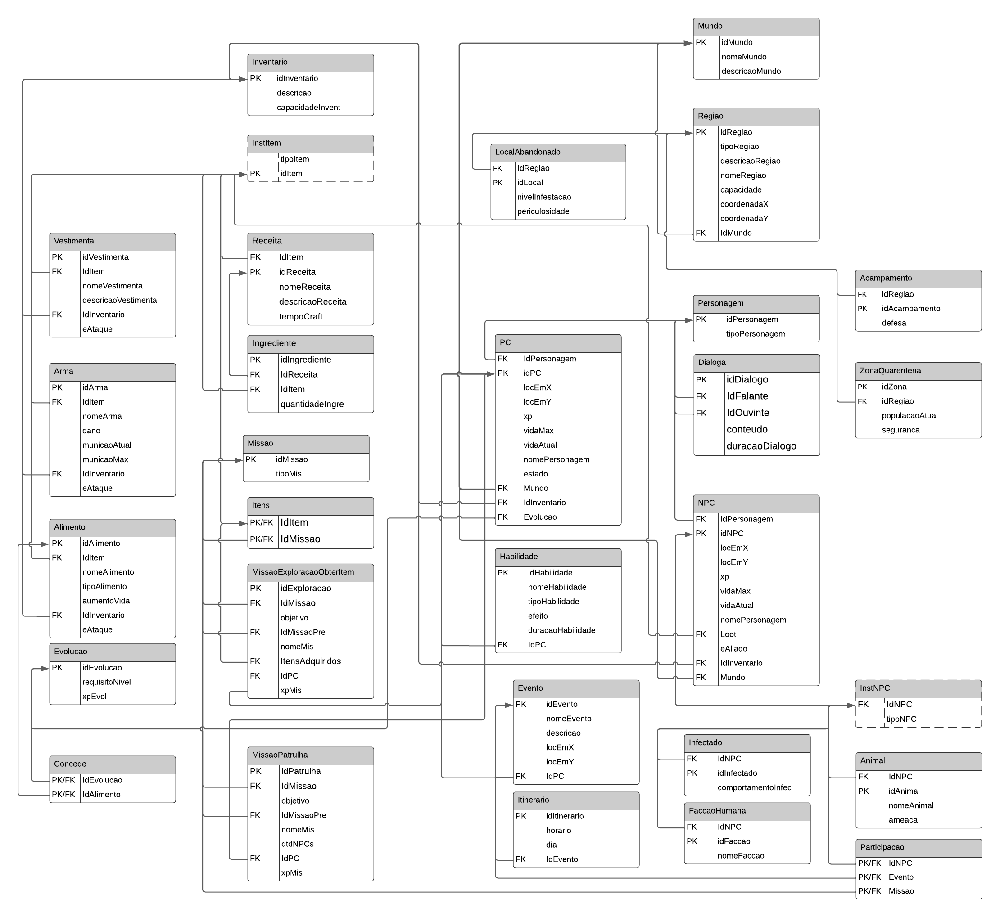

# Modelo Relacional

O Modelo Relacional(MREL) apresenta um diagrama lógico de como as entidades e seus relacionamentos serão mapeados no banco de dados. Esse artefato é um modelo independente de qualquer sistema de gerenciamento de banco de dados (SGBD) específico.
   

*Modelo Relacional The Last of Us - versão 01*
    

*Modelo Relacional The Last of Us - versão 02*
