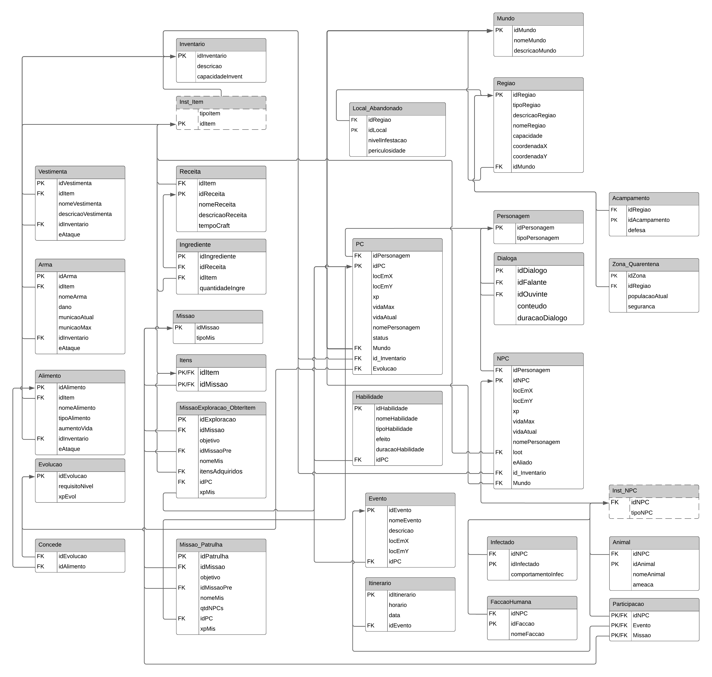
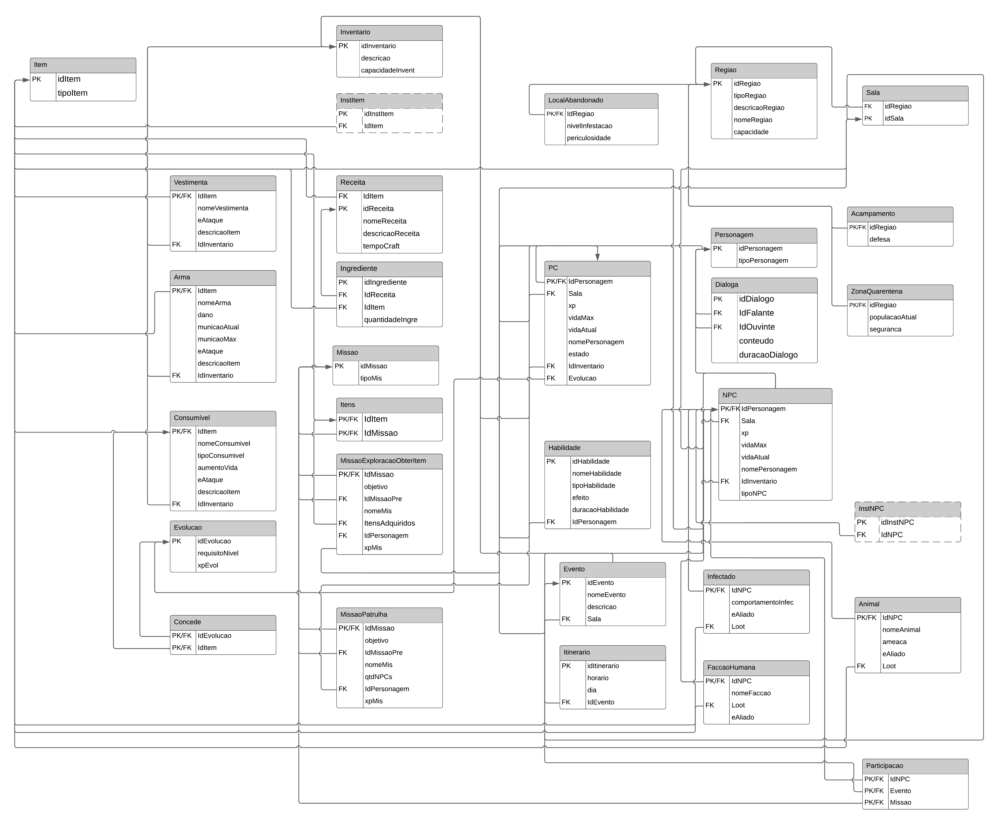

# Modelo Relacional

O Modelo Relacional(MREL) apresenta um diagrama lógico de como as entidades e seus relacionamentos serão mapeados no banco de dados. Esse artefato é um modelo independente de qualquer sistema de gerenciamento de banco de dados (SGBD) específico.

<iframe width="790" height="535" src="https://lucid.app/documents/embedded/3cdfd4bf-5445-4f6a-8a11-fae8673a0a4a" frameborder="0" scrolling="no" allow="fullscreen; clipboard-read; clipboard-write" allowfullscreen></iframe>

  
Versão 1

  
*Modelo Relacional The Last of Us - versão 01*

  
Versão 2

  
  *Modelo Relacional The Last of Us - versão 02*

Fonte: Autores